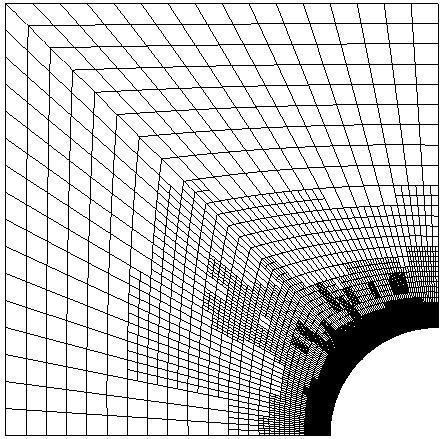

# IGA-and-CAGD-with-THB-splines-using-G-Smo-library
This project in based on my Master thesis "Isogeometric Analysis and Computer Aided Geometric Design with THB-splines using G+Smo library". I have solved many physical problems, like Stationary heat conduction, Convection diffusion, Linear elasticity, Scalar wave propagation. There are also two examples of surface fitting with least-square method using THB-splines.

EXAMPLE 1

EXAMPLE 2

EXAMPLE 3

EXAMPLE 4

EXAMPLE 5

EXAMPLE 6

EXAMPLE 7

